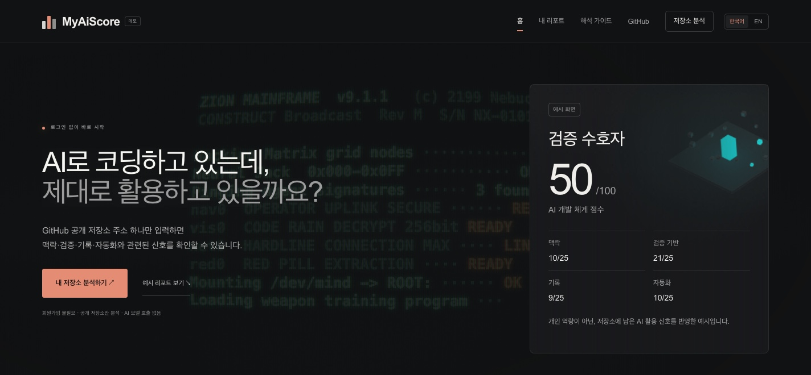
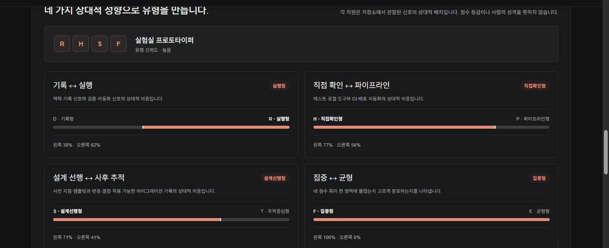
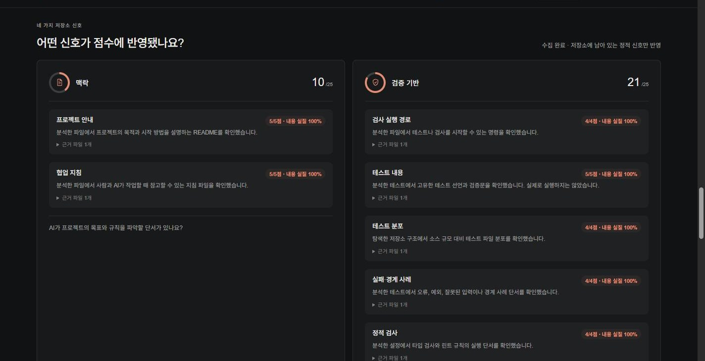

<div align="center">



# MyAiScore

**공개 GitHub 저장소의 문서·검증·기록·자동화 신호를 살펴보는 웹 데모**

로그인도 CLI 설치도 없이, 저장소 주소 하나만 넣으면 됩니다.

[](https://github.com/SangJun-Pyo/MyAiScore/actions/workflows/ci.yml)


**[🚀 라이브 데모 열기](https://myaiscore-production.up.railway.app/)** · [해석 가이드](https://myaiscore-production.up.railway.app/insights) · 원티드 AI 해커톤 출품작

</div>

---

## 목차

- [무엇을 보여주나요?](#무엇을-보여주나요)
- [화면 미리보기](#화면-미리보기)
- [기술 스택](#기술-스택)
- [저장한 리포트](#저장한-리포트)
- [로컬 실행](#로컬-실행)
- [Railway 배포](#railway-배포)
- [검사](#검사)
- [선택 기능: Claude Code 세션 리포트](#선택-기능-claude-code-세션-리포트)
- [설계와 신뢰 경계](#설계와-신뢰-경계)
- [라이선스](#라이선스)

## 무엇을 보여주나요?

로그인이나 CLI 없이 공개 저장소 URL 하나를 입력하면, MyAiScore가 고정 commit의 제한된 파일 표본과 최근 조상 커밋 집계를 읽어 결정론적인 리포트를 만듭니다. 결과에는 내용 실질·규모 범위를 반영한 **AI 개발 체계 점수**, 네 차원 저장소 유형, 실제 근거 경로, 수집 범위, 구조·위생 진단과 우선순위가 정해진 개선 조언이 포함됩니다.

- **AI 개발 체계 점수:** 맥락, 검증 기반, 기록, 자동화를 각각 0–25점으로 계산해 총 100점으로 보여줍니다.
- **네 글자 협업 유형:** 기록/실행, 직접확인/파이프라인, 설계선행/추적중심, 집중/균형의 네 상대 차원을 조합하고 재미있는 유형명으로 항상 표시합니다. 근거가 부족하면 신뢰도 주의 문구를 함께 표시합니다.
- **확인 가능한 근거:** 점수에 사용한 파일 경로와 발견하지 못한 신호를 함께 표시합니다.
- **실행 가능한 조언:** 신호 하나를 개선했을 때의 실제 점수 변화와 고정 작업량을 재계산해 최대 세 개를 추천합니다. 내부 계수는 화면에 노출하지 않습니다.
- **참조 코호트:** 같은 규모와 coverage 상태인 고정 SHA 공개 저장소 그룹이 5개 이상이면 50개 층화 편의 표본 안의 10% 단위 참고 구간을 표시합니다. GitHub 전체 순위가 아닙니다.
- **공유 가능한 결과 카드:** 저장소명·고정 커밋·점수·협업 유형·네 축만 담은 PNG를 저장하거나 지원되는 기기에서 바로 공유할 수 있습니다. 소스 원문은 포함하지 않습니다.
- **공개된 기준:** [해석 가이드](https://myaiscore-production.up.railway.app/insights)에서 v2.7의 축별 세부 신호와 최대점, 유형 차원을 확인할 수 있습니다. 실제 획득점은 파일 존재·내용 실질·scanned-tree breadth를 함께 사용하며, 유형은 점수 등급이 아니라 신호의 상대적 배치로 정해집니다.

> [!NOTE]
> 서비스는 LLM을 호출하지 않고 저장소의 install, build, test, hook 또는 코드를 실행하지 않습니다. 공개 파일 원문을 리포트에 넣거나 분석 결과를 서버 DB에 저장하지 않습니다.
>
> 이 결과는 저장소에서 관찰되는 문서·검증·기록·자동화 신호를 재미있게 요약한 것입니다. 개인의 실제 AI 활용 능력, 코드 품질, 테스트 성공, 기여자 신원, 생산성 또는 채용 적합성을 인증하지 않습니다.

코호트의 선택식, 50개 저장소와 고정 SHA, 분포와 한계는 [코호트 문서](docs/Assessment/Cohorts/README.md)에서 확인할 수 있습니다.

## 화면 미리보기

<table>
<tr>
<td width="50%">

**협업 유형 — 네 차원 스펙트럼**



관찰된 신호가 어느 쪽으로 기울었는지 좌우 스펙트럼 바로 보여주고, 유형 코드·이름·신뢰도를 함께 표시합니다.

</td>
<td width="50%">

**축별 저장소 신호 — 근거와 점수**



축마다 진행률 링과 아이콘을 보여주고, 신호 하나하나를 근거 파일·내용 실질 점수와 함께 카드로 분리합니다.

</td>
</tr>
</table>

## 기술 스택

| 영역 | 사용 기술 |
| --- | --- |
| 프레임워크 | [Next.js](https://nextjs.org/) 16 (App Router, standalone build) |
| UI | React 19, TypeScript 5.7 |
| 배포 | [Railway](https://railway.app/) — `railway.toml` + `Dockerfile` |
| 데이터 저장 | 없음 (서버 DB 미사용) — 저장된 리포트는 브라우저 `localStorage`에만 보관 |
| 저장소 분석 | 공개 GitHub REST API, 고정 commit 표본, 정적 파일 신호만 사용 (코드 실행 없음) |

## 저장한 리포트

결과 화면에서 사용자가 직접 저장한 요약만 현재 브라우저의 localStorage에 최대 20개 보관합니다. 같은 저장소·commit·규칙 버전은 하나로 정리되며 개별 삭제와 전체 삭제를 지원합니다. 계정, 서버 DB, 기기 간 동기화는 없고 브라우저 데이터를 지우면 함께 사라집니다.

## 로컬 실행

Node.js 22 환경에서 실행합니다.

```bash
npm ci
npm run dev -- --port 3100
```

[http://127.0.0.1:3100](http://127.0.0.1:3100)을 열고 `/evaluate`에 공개 저장소 URL을 입력합니다. 기본 흐름에는 계정, Supabase 또는 모델 API 키가 필요하지 않습니다.

반복 시연이나 여러 사용자의 요청을 받을 때는 공개 GitHub API 허용량을 위한 서버 전용 토큰을 설정할 수 있습니다.

```text
GITHUB_TOKEN=<server-only token>
```

> [!WARNING]
> 토큰은 브라우저에 전달되지 않으며 비공개 저장소 분석을 활성화하지 않습니다. 값을 저장소, 채팅 또는 로그에 넣지 마세요.

## Railway 배포

저장소의 `railway.toml`과 `Dockerfile`이 Next.js standalone 빌드, 시작 명령과 `/api/health` 검사를 정의합니다. Railway가 `PORT`를 주입하므로 기본 배포에 별도 DB나 파일 저장소가 필요하지 않습니다. 다중 방문 시연에는 서버 전용 `GITHUB_TOKEN` 설정을 권장합니다.

## 검사

```bash
npm run typecheck
npm test
npm run check:docs
npm run build
npx playwright install chromium
npm run test:e2e
```

## 선택 기능: Claude Code 세션 리포트

설치된 checkout에서는 로컬 Claude Code 세션의 구조적 활동을 별도 리포트로 만들 수 있습니다. 공개 저장소 리포트와 계약이 다른 선택 기능입니다.

```bash
npm run session:report -- --example
npm run session:report -- --project "C:/path/to/project" --out session-report.json
```

원문, 명령과 파일 경로는 요약에 포함하지 않습니다. 패키지는 아직 비공개이며 `npx myaiscore`가 게시됐다고 안내하지 않습니다.

## 설계와 신뢰 경계

- [공개 저장소 리포트 계약](docs/Assessment/REPOSITORY_REPORT.md)
- [ADR-0015: 로그인 없는 한국어 공개 저장소 리포트](docs/Architecture/ADR/0015-anonymous-korean-repository-reports.md)
- [ADR-0016: 한국어 기본·영어 전환](docs/Architecture/ADR/0016-persistent-korean-english-interface.md)
- [개인정보·보안 원칙](docs/Security/PRIVACY_SECURITY.md)

기여 에이전트는 [AGENTS](AGENTS.md) → [ROADMAP](docs/Development/ROADMAP.md) 순서로 현재 상태를 확인합니다.

## 라이선스

MyAiScore에서 직접 작성한 소스 코드는 [MIT License](LICENSE)에 따라 사용할 수 있습니다. 저작권 및 라이선스 고지를 유지하는 조건으로 복사, 수정, 배포와 상업적 이용이 허용됩니다.

저장소에 포함된 제3자 소프트웨어와 디자인 자료에는 각각의 라이선스가 적용됩니다. ThreeUI 관련 저작권과 사용 조건은 [ThreeUI Community 고지](public/third-party/threeui/NOTICE.md)와 [원문 라이선스](public/third-party/threeui/LICENSE.txt)를 확인해 주세요.

`MyAiScore` 이름과 로고 등 프로젝트 식별 표지는 MIT License의 사용 허락 대상에 포함되지 않습니다. 프로젝트를 포크하거나 별도로 배포할 때 원 프로젝트로 오인되지 않도록 다른 이름과 표지를 사용해 주세요.
