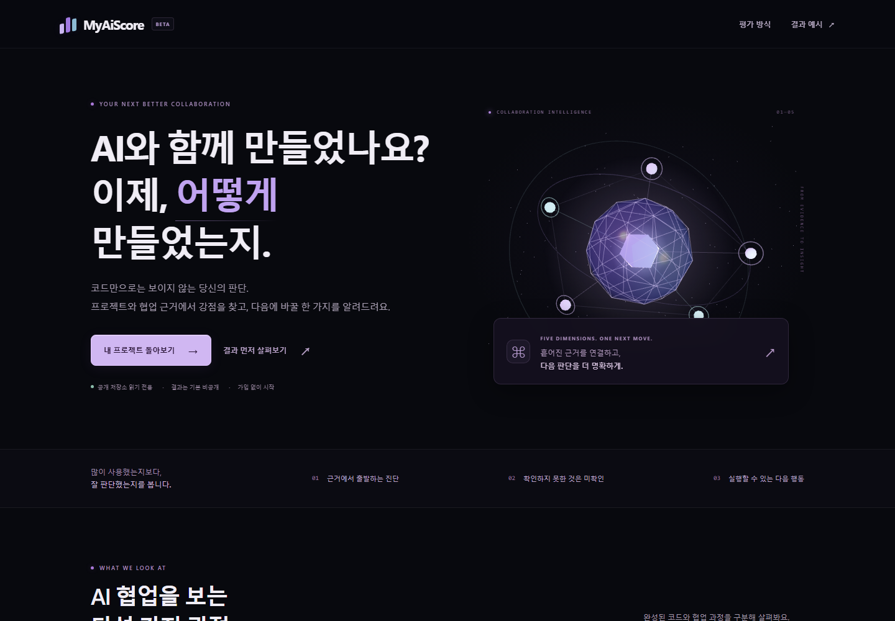

# MyAiScore

공개 GitHub 프로젝트와 AI 협업 근거를 읽고, 다섯 축의 진단과 다음 개선 행동을 제공합니다. 코드 품질이나 토큰 사용량으로 개인의 AI 실력을 인증하지 않습니다.



## 지금 실행하기

Node.js 22 이상이 필요합니다.

```bash
npm ci
npm run dev
```

브라우저에서 `http://127.0.0.1:3000`을 엽니다. 키 없이 한국어 웹 화면과 **synthetic 결과 예시**를 볼 수 있습니다. 예시는 실제 평가가 아니며, 모델 미설정 시 실제 평가 버튼은 비활성입니다.

프로덕션 빌드는 `npm run build`로 만듭니다. 환경 변수 `MYAISCORE_ALLOW_FILE_STORE=true`를 명시한 단일 프로세스 미리보기는 `npm start`로 실행합니다. `.env.local`을 사용하는 프로덕션 미리보기는 `node --env-file=.env.local scripts/start.mjs`로 실행해야 합니다. 운영 저장소는 아래 Supabase 설정을 권장합니다. Next 개발 서버는 환경 파일을 읽지만 standalone 시작 도구와 일반 Node CLI에는 자동 적용되지 않습니다.

## 실제 평가 연결

[.env.example](.env.example)을 `.env.local`로 복사하고 **서버에서만** 다음을 설정합니다.

- `ANTHROPIC_API_KEY`: 서비스용 Anthropic API 키
- `ANTHROPIC_MODEL`: 해당 계정에서 사용할 정확한 모델 ID
- `MYAISCORE_ENABLE_LIVE=true`: 실제 요청 활성화

모델을 임의로 선택하거나 구독 플랜을 API 사용 권한으로 간주하지 않습니다. 실제 모델 호출은 비용이 발생할 수 있습니다. 기본 전역 상한은 UTC 날짜별 **모델 호출 시도 20회**, 소유자별 6회입니다. `MYAISCORE_DAILY_MODEL_CALL_LIMIT`는 호출 수 제한이며 달러 예산 보장이 아닙니다. 기본 평가는 질문/판정 두 호출이고 재시도도 상한에 포함됩니다.

흐름: GitHub URL·선택적 사례/마스킹한 발췌 → 자료 전송 동의 → 커밋 고정 수집 → 질문 3개 → 답변 또는 건너뛰기 → 축별 진단·점수 발급/보류 → 개선 작업서. 자료는 기본 비공개이며 공개 요약은 별도 동의로 만듭니다. 브라우저 탭의 접근 토큰을 잃으면 비공개 결과 복구 기능은 없습니다.

실제 모델용 HTTP adapter는 구현·모의 검증됐지만 **실제 유료 모델 호출, 판정 타당성 교정, 인젝션 방어 실험은 아직 미수행**입니다. 키를 넣었다는 사실만으로 서비스의 평가 정확성이 검증되지는 않습니다.

## 저장과 배포

- 개발: Git에서 제외한 `.data/`의 파일 저장. 같은 Node 프로세스 안에서만 쓰기 직렬화가 보장됩니다.
- 운영: [Supabase migration](supabase/migrations/202609140001_assessment_store.sql)을 적용하고 `SUPABASE_URL`, `SUPABASE_SERVICE_ROLE_KEY`를 서버에 설정합니다. DB 실패 시 파일로 조용히 대체하지 않습니다.
- DB는 서버만 접근하는 RLS 테이블과 revision 기반 CAS를 사용합니다. 현재는 하나의 JSON 문서를 갱신하는 소규모 MVP 저장 방식이며 대규모 데이터·트래픽용 설계가 아닙니다.
- [Dockerfile](Dockerfile)과 [Railway 설정](railway.toml)을 제공합니다. 컨테이너는 `PORT`를 사용하고 `/api/health`가 liveness 경로입니다. 헬스 응답은 모델/DB 설정 검증을 의미하지 않습니다.
- 결과는 7일 뒤 접근이 만료됩니다. 완료 시 임시 분석 context를 제거하며, 만료 기록은 신규 생성 시 또는 `node --env-file=.env.local --import tsx scripts/pruneAssessments.ts`로 정리합니다. 이 CLI는 전체 소스와 `npm ci`가 있는 별도 운영 checkout에서 같은 Supabase 설정으로 실행합니다. 최소 Docker 런타임 이미지에는 이 스크립트와 tsx가 들어 있지 않습니다. 비활성 서비스의 물리 삭제 시점을 보장하려면 별도 checkout의 명령을 운영 스케줄러에 연결해야 합니다. 백업 보존은 DB 운영 설정에 따릅니다.

실제 Supabase 인스턴스·Docker 이미지 실행·Railway 배포는 아직 수행하지 않았습니다. 설정 파일 준비와 배포 완료는 구분합니다.

공식 참고: [Next.js 설치](https://nextjs.org/docs/app/getting-started/installation), [Anthropic Messages](https://platform.claude.com/docs/en/api/messages/create), [Supabase RLS](https://supabase.com/docs/guides/database/postgres/row-level-security), [Railway 설정](https://docs.railway.com/config-as-code/reference).

## CLI와 검증

```bash
npm run typecheck
npm test
npm run check:docs
npm run build
npx playwright install chromium
npm run test:e2e
npm run evaluate -- --example
```

실제 평가는 대화형 터미널에서 환경 변수를 설정한 뒤 실행합니다. 전송 직전 `SEND` 입력을 요구하며 기존 출력 파일을 덮어쓰지 않습니다.

```bash
node --env-file=.env.local --import tsx scripts/evaluateRepository.ts --live --repo https://github.com/OWNER/REPO --out .data/result.json
```

출력 디렉터리는 실행 전에 만들어야 합니다(`mkdir .data`). 출력 파일은 기존 파일과 다른 이름을 사용하세요.

로컬 수집 PoC는 명시적으로 선택한 Claude Code 세션 파일만 읽습니다. 아직 자동 업로드나 npm 배포 기능은 없고, 웹에는 사용자가 검토한 발췌를 직접 붙여넣습니다. 마스킹은 알려진 패턴을 다루는 휴리스틱이므로 민감정보의 완전한 제거를 보장하지 않습니다. 실제 세션 호환성·사람 검토는 별도 검증 대상입니다.

```bash
npm run collect:local -- --project . --session fixtures/local-collection/basic-session.jsonl --json
```

## 작업 관리

상준님 환경의 공용 프로젝트는 `C:/Users/sangj/MyAiScore`이며 에이전트 인계 문서는 그 안의 `docs/`입니다. 별도 worktree는 작업을 분리하는 용도이고, 완료 후 코드와 문서를 함께 공용 checkout에 동기화합니다. 다른 환경에서는 이 저장소를 checkout한 루트의 AGENTS와 ROADMAP부터 읽습니다.

[GitHub 이슈](https://github.com/SangJun-Pyo/MyAiScore/issues)로 범위를 정하고 `codex/` 브랜치와 독립 worktree에서 구현·검토합니다. Astra가 통합을 담당하며 필요한 작업과 독립 검토는 서브에이전트에 맡깁니다.

- [현재 진행 상태](docs/Development/ROADMAP.md)
- [설계 결정 기록 ADR](docs/Architecture/ADR/README.md)
- [통합 구현 세션](docs/Development/Sessions/Phase-04-Web-MVP.md)
- [개발 기록](docs/Development/Sessions/README.md), [결함](docs/Development/BUGS.md), [제품 정본](docs/00_MASTER_PLAN.md)
- 과거 문서와 프롬프트는 이력 자료이며 현재 실행 지시가 아닙니다.
